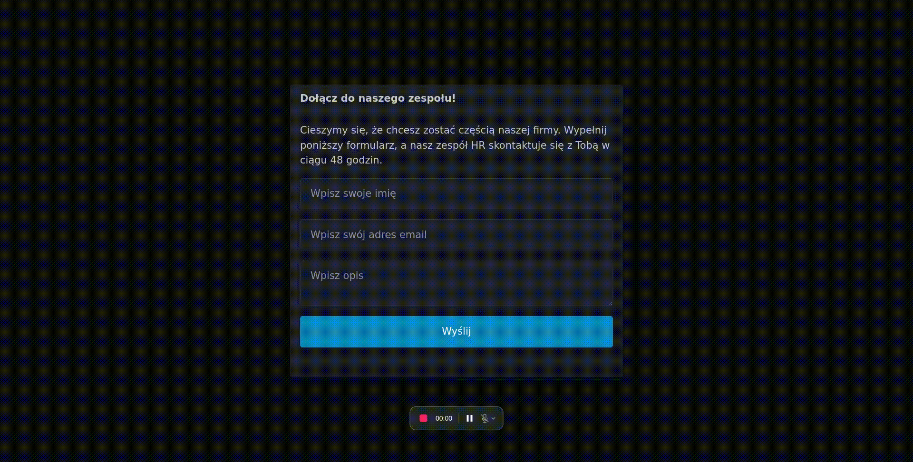

# Dynamic Form Generator

Modern form generation library built with Laravel 11, featuring dynamic field configuration and comprehensive validation.



## Features

### Core Functionality
- Dynamic HTML form generation
- Support for multiple field types (text, email, textarea)
- Customizable field attributes (name, required, class, placeholder)
- Backend validation with custom rules
- Comprehensive error handling
- Success message display

### Advanced Features
- Custom validation rules
- CSRF protection
- XSS prevention

## Tech Stack

### Backend
- Laravel 11 with PHP 8.2+
- Factory Pattern for form generation

### Frontend
- Laravel Blade for server-side rendering
- Pico.css for minimal CSS styling

### Development Tools
- Docker with Laravel Sail
- PHPUnit for testing
- PHPStan for static analysis
- Laravel Pint for PHP styling
- Husky for Git hooks
- PHP-CS-Fixer
- Laravel IDE Helper

## Requirements

- Docker

## Quick Start

### Requirements

- Docker

### Using Docker

0. Make sure you have docker installed and ports are available
```bash
docker -v
systemctl restart docker
```

1. Clone and build
```bash
git clone https://github.com/GrzywN/ddh-recruitment-task-2024.git
cd ddh-recruitment-task-2024
make build
```

2. Start development environment
```bash
make up
```

The application will be available at `http://localhost`.
PHPMyAdmin will be available at `http://localhost:8050`.
Mailpit will be available at `http://localhost:8025`.

### Manual Installation

1. Clone the project

```bash
git clone https://github.com/GrzywN/ddh-recruitment-task-2024.git
```

2. Go to the project directory

```bash
cd ddh-recruitment-task-2024
```

3. Copy environmental config

```bash
cp .env.example .env
```

4. Change docker context to default (for linux users)

```bash
docker context use default
```

5. Install laravel dependencies

```bash
docker run --rm \
  -u "$(id -u):$(id -g)" \
  -v "$(pwd):/var/www/html" \
  -w /var/www/html \
  laravelsail/php83-composer:latest \
  composer install --ignore-platform-reqs
```

Start the server

```bash
./vendor/bin/sail up -d
```

Generate application key

```bash
./vendor/bin/sail artisan key:generate
```

Clear cached configuration

```bash
./vendor/bin/sail artisan optimize:clear
```

Link storage

```bash
./vendor/bin/sail artisan storage:link
```

Run migrations and seeders

```bash
./vendor/bin/sail artisan migrate:fresh --seed
```

Run tests to ensure everything is working fine 🎉

```bash
./vendor/bin/sail artisan test
```

To stop the server simply run

```bash
./vendor/bin/sail stop
```

## Development Commands

```bash
# Code Quality
make lint          # Run PHP and JS/TS linting
make analyse       # Run static analysis
make format        # Format code
make test          # Run all tests

# Documentation
make doc           # Generate IDE helper files
```

## Validation Rules

- Name: Required, 3-50 characters
- Email: Required, valid email format
- Description: Optional, max 500 characters

## Security

- CSRF protection enabled
- XSS prevention
- Input sanitization

## License

This project is open-sourced software licensed under the MIT license.
